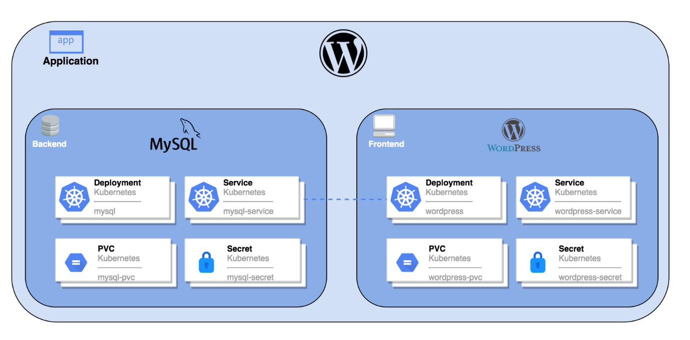
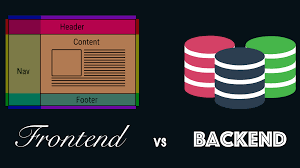

#### day 6
# Deploying WordPress Application with MySQL DB through Kubernetes

#### What is Multi-tier Application?
<h5>Applications divided into two halves, first one is Front end which can be Accessed by the clients, and all the admins, it is open to all.  The main thing is the back-end where the main data is stored.
Similar like thing we will do today, 
We will launch a PHP Application ->Wordpress [Front-end]-> it’s a webapp.
And the other one is MYSQL database -> back-end.</h5>

Actually the scene is this. We{clients}
Are only looking to the Front end.  
No one can see the back end. 
#### What is the use of Envirenmental Variable?
<h5>You can only access after providing information called Shell Variable.
And this only is called, Environmental Variable.
</h5> 
#### Commands Used
Kubectl run mydb –image=mysql:5.7 
Kubectl get pods 
Kubectl logs mydb 
kubectl describe pods mydb  
Kubectl run os1 --image=vimal13/apache-webserver-php 
Kubectl exec –it os1 bash 
echo $x  
Vi /root/.bashrc 
Kubectl run mydbms –image=MYSQL_ROOT_PASSWORD=redhat –env=MYSQL_DATABASE=mydb –env=MYSQL_USER=Abhishek –env=MYSQL_PASSWORD=Abhishek
 Kubectl describe pods mydbms 
Kubectl run mywp1 –iamge=wordpress:5.1.1-php7.3-apache 
Kubectl logs mywp1 
Kubectl expose pod mywp1 –type=NodePort –port=80 
kubectl get svc 
192.168.99.100:31275 
Kubectl exec –it dbms --bash 
Mysql –u Abhishek –pAbhishek 
Use mydb 
Show tables; 
