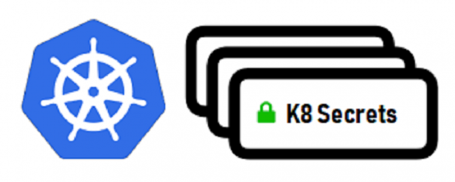
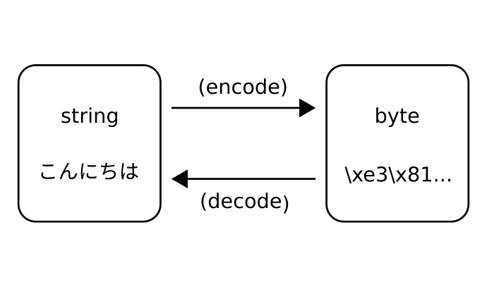

day 7 of Kubernetes
### Secrets

<h4>
In day 6, we have created 2 pods with different containers in which one stores the database(back-end) and one pod stores is Webapp(front-end) with clients only access to the front-end.
 
We created one environmental variables but anyone working with same level or working in group can see that while developing. Its not user friendly. As a boss(leader) of my team I don’t want all to get access to the DB. I am the only one who will have the access. But the question is how we will do this without sharing our password. Since password is visible by describe pods(environmental variables) or by history command it is easy for the workers.
 </h4>

### Here, a concept of Secrets came which is also called as vault in other technologies. But in k8, Secrets are files where you can(Master) saves the password and the workers or developers developing with me can’t see the password.
 
### Benefits of Using Secrets:-
<h4>
•	No one can see Credentials even in Live Training. 
•	I am the only one who has the access to the Database.
 
### What is Encoding?? <h4>
Changing Clear Format to Encoded Data(non-readable) random letters. 
For that we can take help of online Encoders and Decoders. https://www.base64encode.org/

</h4>

<h3>Command Used</h3>
<h6>Kubectl get pods 
Kubectl delete all --all 
Kubectl get secrets 
Kubectl create –f pod7.yml 
Kubectl describe pods 
Kubectl create –f Secret.yml
